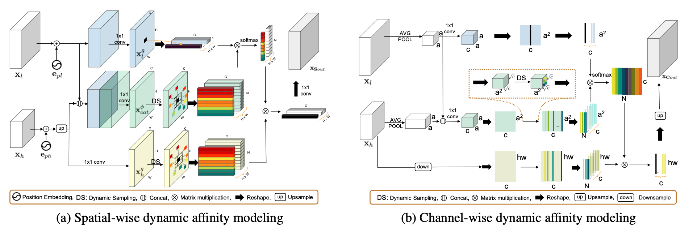

# DDSM

This project implements **Dynamic Dual Sampling Module (DDSM)** of paper **Dynamic Dual Sampling Module  for Fine-grained Semantic Segmentation** which is accepted by **ICIP 2021**.

## Instructions 

Please follow the instructions to run the code.

TODO

## Citation

TODO

## Acknowledgement 
This repo is based on Semantic Segmentation from [SFSegNets](https://github.com/lxtGH/SFSegNets).

